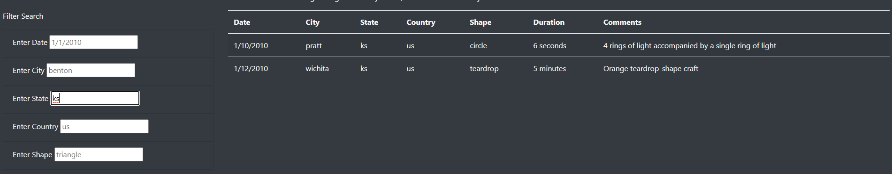

# UFOs

# Overview

The purpose of this challenge was to create a JavaScript array of UFO data that could be filtered and searched using a website.  The original site only had one method of filtering, but other criteria were added to further sort through the data.

# Results

## UFO Finder

## Filter Table

This is how the website appears when first opened.  The search fields are pre-populated with examples of how to enter the data to properly search the database.

This is showing the website after searching for the state of Kansas.  

# Summary

Further coding could be done to remove the case sensitive nature of the searches, as searching for "KS" does not produce results but searching for "ks" does.  Requiring the user to know the specific shapes of the sightings may not be user friendly or a very useful type of search.  Also, writing the date search to search by month or year would be much more useful than having to know the specific date to search for.  As it stands, searching by state or country is the only useful search parameter added to the newly designed site.
